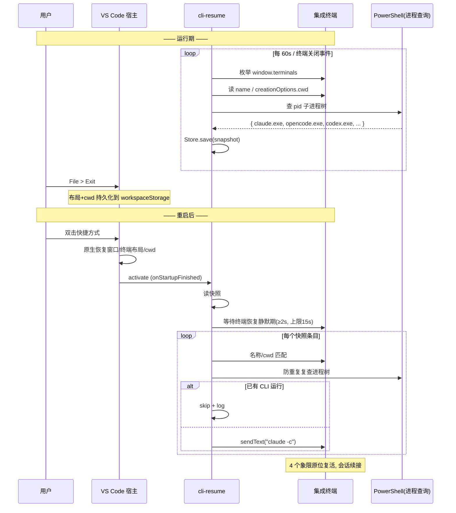

# cli-resume 扩展 — 架构文档 (ARCHITECTURE)

## 1. 架构总览

```
┌──────────────────────────────────────────────────────────────────┐
│                        VS Code 宿主进程                          │
│                                                                  │
│  ┌───────────────┐  ┌───────────────┐  ┌──────────────────────┐  │
│  │   工作台核心   │  │   扩展宿主     │  │  集成终端子系统       │  │
│  │ (窗口/布局恢复) │  │ (Node.js)     │  │ (原生恢复布局+cwd)    │  │
│  └───────┬───────┘  └───────┬───────┘  └──────────┬───────────┘  │
│          │                  │                      │              │
│          │       ┌──────────▼──────────┐  ┌────────▼──────────┐  │
│          │       │   cli-resume 扩展    │  │  Terminal 实例们   │  │
│          │       │                    │  │  (cmd → CLI 子进程) │  │
│          │       │  ┌──────────────┐  │  └────────┬──────────┘  │
│          │       │  │ Snapshot     │◄─┼───────────┤             │
│          │       │  │ Service      │  │           │             │
│          │       │  └──────┬───────┘  │           │             │
│          │       │         │          │           │             │
│          │       │  ┌──────▼───────┐  │           │             │
│          │       │  │ Detector     │──┼───────────┘ (进程树查询)│
│          │       │  │ (进程树适配器)│  │                          │
│          │       │  └──────────────┘  │                          │
│          │       │         │          │                          │
│          │       │  ┌──────▼───────┐  │                          │
│          │       │  │ Snapshot     │  │                          │
│          │       │  │ Store        │  │                          │
│          │       │  │ (workspaceState)│                         │
│          │       │  └──────────────┘  │                          │
│          │       │         │          │                          │
│          │       │  ┌──────▼───────┐  │                          │
│          │       │  │ Restore      │──┼──► terminal.sendText()   │
│          │       │  │ Service      │  │                          │
│          │       │  └──────────────┘  │                          │
│          │       └────────────────────┘                          │
│          └───────────────────────────────────────────────────────┘
│                     ▲                    ▲                        │
│                 File > Exit         双击快捷方式启动               │
└──────────────────────────────────────────────────────────────────┘
```

职责边界（单一职责）:

| 模块 | 职责 | 不做什么 |
|---|---|---|
| SnapshotService | 编排快照流程（何时采集、采集什么） | 不执行进程查询 |
| Detector (ProcessTreeAdapter) | 给定终端 PID → CLI 类型 | 不读写状态 |
| SnapshotStore | 快照序列化/校验/持久化 | 不懂业务 |
| RestoreService | 匹配终端、注入命令、防重复 | 不修改布局 |
| OutputChannel 封装 | 日志 | — |

## 2. 目录结构

```
cli-resume-extension/
├── package.json            # 清单: activationEvents=onStartupFinished, contributes.configuration
├── tsconfig.json
├── src/
│   ├── extension.ts        # activate() 入口: 装配模块、注册命令
│   ├── snapshot/
│   │   ├── SnapshotService.ts
│   │   ├── model.ts        # Snapshot / TerminalSnapshot 类型 + JSON Schema
│   │   └── SnapshotStore.ts
│   ├── detect/
│   │   ├── Detector.ts     # 面向业务接口: detect(pid) => CliType
│   │   ├── CliType.ts      # 'claude' | 'opencode' | 'codex' | 'unknown'
│   │   ├── windows/
│   │   │   └── WindowsProcessTree.ts   # PowerShell Get-CimInstance 实现
│   │   └── index.ts        # 平台选择工厂
│   ├── restore/
│   │   ├── RestoreService.ts
│   │   ├── matcher.ts      # 名称优先/cwd兜底 匹配策略
│   │   └── commands.ts     # CliType → 续接命令映射(可被配置覆盖)
│   └── util/
│       ├── logger.ts       # Output Channel 封装
│       └── timing.ts       # 静默期等待、有界等待工具
└── docs/
    ├── DESIGN.md
    └── ARCHITECTURE.md
```

## 3. 数据模型

```ts
// model.ts
type CliType = 'claude' | 'opencode' | 'codex' | 'unknown';

interface TerminalSnapshot {
  name: string;        // 终端名（VS Code 持久化，主匹配键）
  cwd: string;         // 兜底匹配键（creationOptions.cwd ?? shellIntegration.cwd）
  cli: CliType;        // 检测结果
}

interface Snapshot {
  schemaVersion: 1;
  capturedAt: string;  // ISO 时间，调试用
  terminals: TerminalSnapshot[];
}
```

持久化形态：`workspaceState.get('cliResume.snapshot')` → 序列化为 JSON 存进 workspaceStorage（按工作区隔离，天然支持多工作区并行）。

Schema 演进规则：`schemaVersion` 不符 → 丢弃并记录日志（宁可重来也不猜旧格式）。

## 4. 关键流程

### 4.1 快照流程（运行期）

```
┌──────────┐   onDidCloseTerminal / 60s tick
│ 触发     │──────────────────────────────┐
└──────────┘                              ▼
                          ┌──────────────────────────┐
                          │ SnapshotService.capture()│
                          └──────────┬───────────────┘
                                     │ window.terminals 逐个
                                     ▼
                          ┌──────────────────────────┐
                          │ 采集 name + cwd           │
                          │ (creationOptions.cwd      │
                          │  ?? shellIntegration.cwd) │
                          └──────────┬───────────────┘
                                     │ processId
                                     ▼
                          ┌──────────────────────────┐
                          │ Detector.detect(pid)      │──► 未到超时(3s) → unknown
                          └──────────┬───────────────┘
                                     ▼
                          ┌──────────────────────────┐
                          │ Store.save(snapshot)      │  (workspaceState.update)
                          └──────────────────────────┘
```

### 4.2 恢复流程（启动期）

```
activate (onStartupFinished)
        │
        ▼
┌─────────────────────┐
│ 读快照              │   无/损坏 → no-op
└──────────┬──────────┘
           ▼
┌─────────────────────┐
│ 等待布局恢复完成      │   静默期策略:
│ (终端打开事件静默 ≥2s)│   onDidOpenTerminal 后 2s 内无新事件 ⇒ 判定恢复结束
│ 上限 15s            │
└──────────┬──────────┘
           ▼
┌─────────────────────┐
│ 匹配 (matcher)       │   1) 名称精确匹配(优先,一对一,用后移除)
│                     │   2) 剩余条目按 cwd 匹配
└──────────┬──────────┘
           ▼
   对每个匹配对:
┌─────────────────────┐
│ 防重复: 复查进程树    │   已在跑 CLI → skip(日志)
└──────────┬──────────┘
           ▼
┌─────────────────────┐
│ 等 shell 就绪        │   processId 有值即可(上限5s)
└──────────┬──────────┘
           ▼
┌─────────────────────┐
│ sendText(cmd, true) │   claude → "claude -c"
└─────────────────────┘   opencode → "opencode -c"
                          codex   → "codex resume --last"
```

### 4.3 时序图（完整生命周期）



## 5. 进程树检测（Windows 适配器）

```
终端 processId (cmd.exe / pwsh.exe)
        │
        ▼ 递归查子进程 (Get-CimInstance Win32_Process -Filter "ParentProcessId=X")
┌───────────────────────┐
│ 子进程名归一化判断:     │
│   claude.exe    → claude
│   opencode.exe  → opencode
│   codex.exe     → codex
│   node.exe(命令行含 codex.js) → codex
│   node.exe(命令行含 claude)   → claude
│   codex-code-mode-host.exe   → unknown(扩展自用,不算)
│   其它          → 继续向孙进程递归(最大深度 3)
└───────────────────────┘
```

实现要点:

- 调用方式 `child_process.execFile('powershell.exe', ['-NoProfile','-NonInteractive','-Command', ...])`，返回 JSON 解析；进程查询加 3s 超时，超时降级 unknown
- 幂等：同一 PID 缓存结果 30s，避免周期快照重复开销
- 平台工厂：`detect/index.ts` 按 `process.platform` 选适配器；Linux/macOS 后续用 `ps -o comm= --ppid <pid>` 实现同接口

## 6. 配置面（全部可选）

```jsonc
// settings.json
{
  // 总开关, 默认 true
  "cliResume.enabled": true,
  // 快照周期(秒), 默认 60
  "cliResume.snapshotIntervalSec": 60,
  // 命令模板覆盖(默认如下, 无需设置)
  "cliResume.commands": {
    "claude": "claude -c",
    "opencode": "opencode -c",
    "codex": "codex resume --last"
  },
  // 恢复前等待布局完成的静默期(毫秒), 默认 2000
  "cliResume.restoreQuietMs": 2000
}
```

## 7. 错误处理策略

- 分层捕获：`activate` 顶层 try/catch → 记日志，绝不让异常冒泡到扩展宿主
- 快照失败 → 保留上一版快照（store 只在成功序列化后更新）
- 检测失败/超时 → 该终端记 unknown，不影响其它
- 恢复注入失败（终端已关闭等）→ 跳过 + 日志，其余继续
- 输出面板分级：`[info]` 正常动作，`[warn]` 跳过及原因，`[error]` 异常堆栈

## 8. 测试策略

| 层 | 手段 |
|---|---|
| 单元 | matcher（名称/cwd 匹配、重复、溢出）、commands 映射、Snapshot 序列化往返、schema 版本守卫 |
| 集成(手动) | Windows 真机清单：4 分屏多 CLI → Exit → 重开 → 逐一核对；无快照首次启动；重复名；已手动启动；WSL 终端；强杀后重启 |
| 回归 | 对 VS Code 1.125 / 1.135 各跑一遍清单 |

## 9. 已知限制与风险

| 限制 | 影响 | 缓解 |
|---|---|---|
| 依赖 File > Exit 优雅退出 | X 关光窗口无布局可恢复 | 输出面板提示；不可自动化 |
| Windows 专用进程检测 | 其它平台目前 unknown | 适配器接口已留，后续补 Linux/macOS |
| 会话恢复语义 = 最近会话 | 同目录多历史会话时只续最近 | `-c`/`--last` 本身语义如此，符合直觉 |
| 快照周期窗口(≤60s) | 崩溃前最后 60s 内新建终端不恢复 | 可调小周期；关闭事件触发即时快照兜底 |
| codex 依赖 node 垫片(NVM PATH) | 环境坏时 codex 起不来 | 与扩展无关的环境问题；命令模板可改为原生 exe 直调 |

## 10. 里程碑

- M1 骨架：工程初始化、Output Channel、SnapshotStore + 周期快照（只记 name/cwd）
- M2 检测：Windows ProcessTree 适配器 + 单测
- M3 恢复：matcher + RestoreService + 防重复
- M4 打磨：配置面、静默期策略、错误分级、文档
- M5 打包 vsix + 真机验收清单
